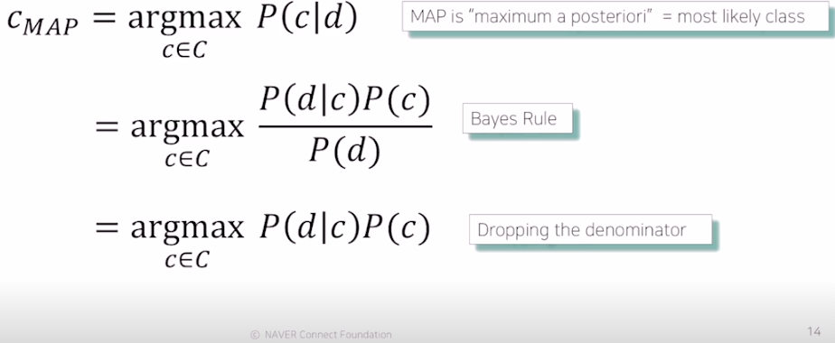

Boostcamp Day 16. 2021-02-15.

# Natural Language Processing (NLP) - Bag-of-Words, Word Embedding

### Contents
- Bag-of-Words
    - NaiveBayes Classifier
- Word Embedding
    - Word2Vec
    - GloVe

## Intro 
- Goal of This Course  
Natural language processing(NLP), which aims at properly understanding and generating human languages, emerges as a crucial application of artificial intelligence, with the advancements of deep neural networks.

- Bag-of-Words  

자연어 처리의 첫 시간으로 NLP에 대해 짧게 소개하고 자연어를 처리하는 가장 간단한 모델 중 하나인 Bag-of-Words를 소개합니다.

Bag-of-Words는 단어의 표현에 있어서 one-hot-encoding을 이용하며, 단어의 등장 순서를 고려하지 않는 아주 간단한 방법 중 하나입니다. 간단한 모델이지만 많은 자연어 처리 task에서 효과적으로 동작하는 알고리즘 중 하나입니다. 

그리고, 이 Bag-of-Words를 이용해 문서를 분류하는 Naive Bayes Classifier에 대해서 설명합니다.

이번 강의에서는 단어를 벡터로 표현하는 방법, 문서를 벡터로 표현하는 방법에 대해 고민해보면서 강의를 들어주시면 감사하겠습니다.  

- Word Embedding  

단어를 벡터로 표현하는 또 다른 방법인 Word2Vec과 GloVe를 소개합니다.

Word2Vec과 GloVe는 최근까지도 자주 사용되고 있는 word embedding 방법입니다. Word2Vec과 GloVe는 하나의 차원에 단어의 모든 의미를 표현하는 one-hot-encoding과 달리 단어의 distributed representation을 학습하고자 고안된 모델입니다. Word2Vec과 GloVe가 단어를 학습하는 원리를 중심으로 강의를 들어주시면 감사하겠습니다

 

# Bag-of-Words
자연어처리나 Text Mining 분야에서 deep learning이 적용되기 전에 많이 사용된 방법. 단어나 문서를 숫자로 표현하는 기법.
## Bag-of-Words Representation
- Step 1. Constructing the vocabulary containing `unique words`.
    - 중복된 단어를 제거하고 주어진 문장을 사전에 일단 저장.
- Step 2. Encoding unique words to `one-hot vectors`.
    - 각 단어별로 one-hot vector를 만듬.(word embadding과 대비됨. 뭐가?)
    - 단어의 의미와 상관없이 일단 처음엔 모든 쌍이 $\sqrt 2$ distance를 가짐.
    - 그리고 각 벡터의 내적, cosine similarity is 0(zero)으로 동일함.
    - 이렇게 단어의 벡터 표현형을 설정함.
- A sentence/document can be represented as the sum of one-hot vectors
    - Sentence 1 : "John really really loves this movie"
        - Jon + really + really + loves + this + movies : `[1 2 1 1 1 0 0 0]`
    - Sentence 2 : "Jane really likes this song"
        - Jane + really + likes + this + song : `[0 1 0 1 0 1 1 1]`

이러면 분류를 하기위한 준비가 끝난거, 그 다음 이를 분류할 수 있는 `Naive Bayes Classifier` 에 대해 보자궁.

# Naive Bayes Classifier
Bayes' Rule Applied to Documents and Classes. 나이브 베이즈 규칙에 적용된 문서나 클레스들을 보자면,

- for a document *d* and a class *c*.

- for each word $w_i$, we can calculate conditional probability for class $c$
    - $P(w_k\vert c_i)={n_k\over n'}$ , where $n_k$ is occurrences of $w_k$ in documents of topic $c_i$.  

 > `Class(c)` 를 고정해두고(주어지면), 각각의 `word(W)`가 나올 확률을 `독립적`으로 보겠다는 뜻.  

 > 그렇담 실제에서는? 당연히 모든 단어들이 독립적이지 않으니깐 딥러닝을 사용하는거 아닙니까용. 일단 naive 방식은 단순하게 모든 단어를 독립적으로 본다고 가정하고 사용하는 방법이고 간간히 성능이 좋으니..

- We calculate the conditional probability of the document for each class.
- We can choose a class that has the highest probability for the document.

> 어느 확률값이 큰지를 보고 최종적으로 큰 클래스의 확률값을 기반으로 예측을 한다. 이게 classfier가 동작하는 방식.

### 문제점
하지만 만약 연관이 깊은 단어임에도 불구하고 단어가 직접적으로 들어있지 않으면 확률값을 0으로 보기때문에 이를 개선하기 위해서 `Regularization` 등이 추가적으로 필요함. 그리고 이러한 파라미터 추정방식은 MLE(Maximum Likelihood Estimation) 를 통해 도출이 되고 이거 관련해서 더 찾아보자.

 

# Word Embedding
- What is Word Embedding?
    - Express a word as a vector
    - 'cat' and 'kitty' are similar words, so they have similar vector representations -> `short distance`
    - 'hamburger' is not similar with 'cat' or 'kitty', so they have different vector representations -> `far distance`
    - `방법론`임.  단어의 의미를 벡터로(2D or 3D) 변환하는 것을 임베딩이라 하고 그 방법이 여러가지가 있지만 대표적으로 word2vec, GloVe가 있다.

# Word2Vec
- An algorithm for training vector representation of a word from context words(adjacent words)
- Assumption : words in similar context will have similar meanings
> 주어진 문장에서 특정한 단어는 주변의 단어들로 유추해서 해석할 수 있다. 즉, 문장에서 단어들 사이의 거리가 가까울수록 관계성이 있다고 보고 만들어진 알고리즘.
등장한 단어의 주변 단어를 확률분포로 보고 예측한다.

 

# GloVe
- GloVe : Global Vectors for Word Representation.  
- Rather than going through each pair of an input and and output words, it first computes the co-occurrence matrix, to avoid training on identical word pairs repetitively.
- Afterwards, it performs matrix decomposition on this co-occurrent matrix.  
    - 앞에 배운 Word2Vec은 한 윈도우 내에서 빈번하게 등장하는 쌍의 단어들을 계속해서 내적(계산)하는 방법이다. 하지만 Window 크기 내에서만 바로 주변 단어만을 고려하기 때문에 문장 전체 혹은 문맥의 정보는 반영하기 어렵다.

    
- $J(\Theta) = {1 \over 2} \sum_{i,j=1}^Wf(P_{ij})(u_i^Tv_j-\log P_{ij})^2$
    - 
    - 그래서 Glove는 입력어들의 embadding vector인 $v_i$ 와 출력 embadding vector인 $v_j$ 의 `내적`값에서 두 벡터가 한 윈도우 내에서 몇번 등장했는지의 값($P_{ij}$)에 log를 취해서 결국엔 내적값이 로그취한 값에 가까워 질 수 있게 loss function을 사용해서 중복된 계산을 Word2Vec에 비해 훨씬 적게해서 빠름.

- Fast training and Works well even with a small corpus.
    - 미리 확률을 계산해서 단어의 등장 빈도를 계산하기 때문에 연산량이 줄어들고, 그래서 학습이 빠르고 더 적은 Data로도 잘 동작한다.
    - Word2Vec이랑 GloVe랑 비등비등함.

  

# Further Questions
- Word2Vec과 GloVe 알고리즘이 가지고 있는 단점은 무엇일까요?

    

## Reference

- bootcamp AI Tech pdf  .
- NAVER Connect Foundation.
- [Word2Vec, NeurIPS'13](https://arxiv.org/abs/1310.4546)
- [GloVe, EMNLP'14](https://www.aclweb.org/anthology/D14-1162/)

