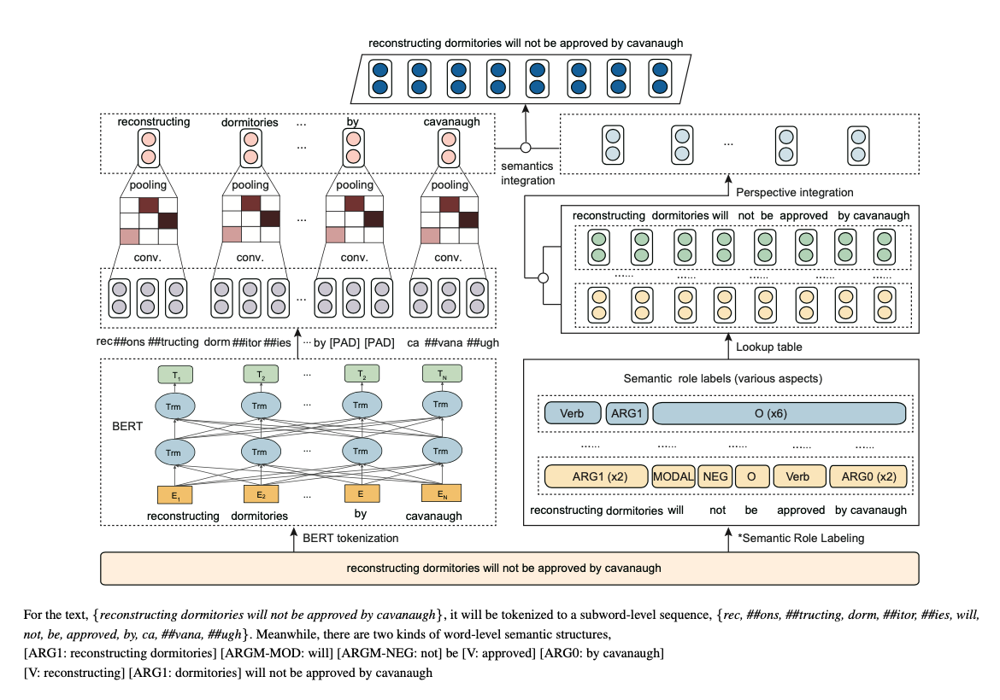
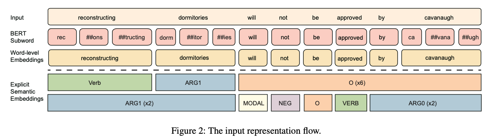

2022-06-25. 두번째 논문 리뷰.

> Top 4th papers in the SNLI dataset section of papers with code.
    >> Papers with Code(NLI:SNLI dataset 기준)상위 논문.  
    >>> 1. Entailment as Few-Shot Learner.
    >>> 2. Self-Explaining Structures Improve NLP Models.
    >>> 3. CONDITIONALLY ADAPTIVE MULTI-TASK LEARNING: IMPROVING TRANSFER LEARNING IN NLP USING FEWER PARAMETERS & LESS DATA.
    >>> 4. Semantics-aware BERT for Language Understanding.

- Contents
    - Abstract
    - Introduction
    - Background and Related Work
    - Semantics-aware BERT
    - Model Implementation
    - Experiments (skip)
    - Analysis
    - Conclusion
    
---

 

# Abstract

- Language representations에 대한 최근의 연구들은 contexualized features를 언어모델 training에 신중하게 통합하여 어느정도 성공을 거뒀다. 특히 기계번역이나 자연어 추론에서.

- 그러나, ELMo, GPT 및 BERT를 포함한 기존의 언어 모델은 `Character` 또는 `Word Embedding`과 같은 `일반적인 상황(plain context)에 맞는 feature만 활용`한다.

- Language representaion을 위한 `더 풍부한 semantic`(의미론적)을 제공할 수 있는 구조화된 semantic information을 통합하는 것을 거의 고려하지 않는다. 

- Natural Language Understading을 더 증진시키기 위해서, 우리는 `pre-trained된 Semantic Role Labeling`으로부터 명시적인 `semantic을 통합`하고 그리고 개선된 language representation model인 Semantic-aware BERT(SemBERT)를 도입하고, `BERT backbone을 통해 contextual semantic을 명시적으로 흡수`할 수 있도록 하였다. 

- SemBERT는 task-specific modification 없이 가볍게 fine-tunning 방식으로 그대로 사용한다. BERT에 비해 semantics-aware BERT는 개념이 더 단순하지만 강력하다.

  

# 1. Introduction
- 최근 LM 성능 좋음 쉽게 sota도 찍고 pre-trained된걸로 downstream task하면 쉽게 할 수 있음.
- 현재 language modeling에만 초첨을 둔게 맘에 걸림
- 현재 주요 한계는 representation 및 training objective에 대한 명확한 contextual feature을 취하는것에만 있으며, 명확한 contextual semantic단서는 전혀 고려 안하는거 같음
- 물론 pre-trained가 잘 된거는 암시적으로 contextual semantic을 잘 represent할 수 있지만 external knowledge를 통합하여 더 좋게 만들 수 있음
- 솔직히 딥러닝 모델이 자연어를 실제로 이해한다고는 말 못함. adversarial attack으로 부터 심각하게 어려움을 겪고 있음.
- 예를 들면 크게 의미 없는 단어에 attention을 주고 중요한 단어를 무시하는 경우도 있음.
- 그래서 semantic role labeling(SRL)과 같이 누가, 어디서, 언제, 왜, 무엇을 했는지를 추가로 사용하겠다능.
- 닝갠은 일반적으로 다양한 술어-논항(predicate-argument)구조를 사용하지만 뉴럴 모델은 다중 의미 구조의 modeling을 거의 사용 안하고 encoding함.
- 그래서 우리 SemBERT로 여러 술어별 논항 시퀀스에 문장의 contextual semantic을 풍부하게 가져가겠음  
 
> 1. 다양한 semantic role label로 입력 문장에 주석을 달기 위한 out-of-shelf semantic role labeler
> 2. pre-trained language model을 사용해서 input raw text에 대한 representation을 만들고 semantic role labeld이 embedding되도록 맵핑하는 sequence encoder
> 3. text representation을 contextual explicit semantic embedding과 통합하여 downstream task에 대한 joint representation을 얻는 semantic integration componet   

  

# 2. Background and Related Work
## 2.1 Language Modeling for NLU
## 2.2 Explicit Contextual Semantics

---

  

# 3. Semantics-aware BERT

- Figure 1은 semantics-aware BERT의 framework.
- SemBERT는 multiple sequence inputs을 처리할 수 있도록 디자인되었다.

- SemBERT에서 input sequence의 단어는 semantic role labeler(`SRL`)로 전달되어 `explicit semantic의 여러 술어 파생 구조`(tag)를 가져오고 그에 해당하는 embedding은 `linear layer`이후 집계되어 최종 `sementic embedding`을 형성한다.

- 동시에(병렬적으로) input sequence는 BERT word-piece `tokenizer`에 의해 `subword`로(있는 경우) 분할되고 subword representation은 `convolution layer`를 통해 `word level로 다시 변환`되어 `contextual word representation`을 얻는다.

- 마지막으로 **word representation** 및 **semantic embedding**이 `concatenated` 되어서 downstream task에 대한 `joint representation`을 형성한다.  

 

## 3.1 Semantic Role Labeling

- Data pre-processing 과정에서 각 문장은 `SRL`(pre-trained semantic labeler)를 사용해 여럿의 `semantic sequences로 주석처리` 된다.

- semantic role의 PropBank 스타일을 사용하여 input sequence의 모든 token에 semantic label을 표시한다.

- 특정 sentence가 주어지면 다양한 `술어-논항` 구조가 된다.

- Figure1에 보듯이 [*reconstructing dormitories will not be approved by cavanaugh*] 이라는 문장에서 문장의 술어 관점에서 두 가지 semantic structure가 있다.

- 다차원 semantic을 찾아내기 위해 `semantic label을 그룹화`하고 `다음 encoding component(구성요소)의 text embedding과 통합`한다. 
- input data flow는 Figure2에 나와있다.

   
    
 
   
## 3.2 Encoding
- `raw text` sequence 그리고 `semantic role label` sequences 들은 처음에 pre-trained BERT에 `feed`(학습하기 위해 전달)하기 위해 `embedding vector`로 표현된다.

- input sentence $X = \{ x_1, \cdots, x_n \}$ 는 길이가 $n$ 인 단어의 시퀀스고, 먼저 word piece로 tokenize된다. 그 다음에 transformer encoder는 self-attention을 통해 각 token에 대한 contextual information을 capture하고 contextual embedding을 생성한다.

- 각 술어와 관련된 $m$ label sequence의 경우 $T = \{ t_1, \cdots, t_n \}$이다. 여기서 $t_i$는 $\{ label^i_1, label^i_2, \cdots, label^i_n \}$로 표시되는 $n$개의 label이다.

- 레이블은 word-level이므로 길이는 $X$의 원래 문장 길이 $n$과 같다. 
- semantic signal을 embedding으로 간주하고 lookup table을 사용하여 이러한 label을 $vector \{ v^i_1, v^i_2, \cdots, v^i_n \}$에 맵핑하고 BiGRU layer에 feed하여 latent space에서 label sequence $m$에 대한 label representation을 얻는다.

$$ e(t_i) = BiGRU(v^i_1, v^i_2, \cdots, v^i_n) where 0 < i \leqslant m $$

- $m$개의 label sequence의 경우 $L_i$는 token $x_i$의 label sequence를 나타내도록 하고,
$e(L_i) = \{ e(t_1), \cdots, e(t_m) \}$

- label representations의 $m$ sequence를 concatenation하고 그것들을 차원 $d$에서 joint representation을 얻기 위해 fully-connected layer로 feed한다.

$$ e'(L_i) = W_2\left[ e(t_1), e(t_2), \cdots, e(t_m) \right] + b2,$$  

$$ e^t = \{ e'(L_1), \cdots, e'(L_n) \} $$

- $W_2, b_2$는 학습가능한 파라미터.

 

## 3.3 Integration
- Integration Module은 `lexical(사전적) text embedding`과 `label representations`를 `융합`한`다.
- 원래 오리지날 pre-trained BERT는 `subword 기반`이지만, 반면에 우리가 제안하는 것은 semantic label은 `word에 기반`하고 있기 때문에 서로 다른 크기의 `sequence들을 맞출 필요`가 있다.
- 따라서 각 word에 대한 subword를 `그룹화`하고 `max pooling과 CNN을 사용`하여 word-level representation을 얻는다.
- CNN이 빨라서 선택했고, 예비 실험에서 CNN에 의해 capture된 local feature가 LM Modeling에 RNN보다 더 나은 결과를 가져오는 것을 보여준다.

- 예를 들면, 단어 $x_i$가 subword $\left[ s_1, s_2, \cdots, s_l \right]$로 구성된다고 가정하면, 여기서 $l$은 단어 $x_i$의 subword 갯수이다.
- BERT에서 subword $s_j$를 $e(s_j)$로 표시한다. 
- 먼저 Conv1D layer를 다음과 같이 사용한다.
$$ e'_i = W_1 \left[ e(s_i), e(s_{i+1}), \cdots, e(s_{i+k-1}) \right] $$

(b1, W1은 trainable parameter, k는 kernel size)

- 그런 다음 ReLU및 max pooling을 $x_i$의 output embedding sequence에 적용한다.

$$ e*_i = ReLU(e'_i), e(x_i) = MaxPooling(e^*_1, \cdots, e^*_{l-k+1}) $$

- 따라서, word sequence $X$에 대한 whole representation은 
- $ e^w = \{ e(x_1), \cdots, e(x_n) \} \in  \mathbb{R^{n\times d_w}}$로 표현된다. 여기서 $d_w$는 word embedding의 dimension을 나타낸다.
- aligned context 및 distilled semantic embedding은 fusion function $h = e^w \Diamond e^t$에 의해 병합된다. 여기서 $\Diamond$는 Concatenation을 나타냄. (summation, multiplication 및 attention mechanism을 시도했지만 concatenation이 가장 좋은 결과를 보여줌)

---

  

# 4. Model Implementation
- SemBERT의 일부분 구현을 소개. SemBERT는 광범위한 task를 위한 선행 encoder가 될 수 있으며 예측을 위한 linear layer만 있는 end-to-end model이 될 수도 있다. simple하게 하기 위해 fine-tunning후 inference를 직접 제공하는 간단한 find-tuning만 보여주것으.

## 4.1 Semantic Role Labeler
- Semantic Label을 얻기 위해 pre-trained된 SRL Module을 사용하여 모든 술어와 해당 논항을 한번에 예측한다. Peters et al.(2018)을 구현했으며 CoNLL-2012 shared task를 위해 English OntoNote v5.0 benchmark에서 F1 84.6%를 달성하였다. 구현시 총 104개의 label이 있으며 논항이 아닌 단어는 $O$를 사용하고 술어에는 동사 label을 사용.

> 이거 멀티링구얼 아니라서 한국어는 아마 안될껄요? kakao Pororo의 SRL로 대체해서 사용해야할듯?

## 4.2 Task-specific Fine-tuning
- Section 3.에서는 semantics-aware BERT representation을 얻는 방법을 설명했다. 여기에서는 classification, regression 및 span-based MRC task에 SemBERT를 적용하는 방법을 보여준다. Fused contextual semantic 및 LM representation $h$를 더 낮은 차원으로 변환하고 예측 분포를 얻는다.

- Classification 및 regression task의 경우 $h$는 class logit 또는 score를 얻기 위해 fully connection layer로 feed 된다. Training objective는 classification task를 위한 CrossEntropy와 regresstion task를 위한 Mean Square Error loss 이다.

- span-based reading comprehension을 위해 $h$ 는 모든 token의 start logit 및 end logit을 얻기위해 fully connection layer로 feed 된다. 위치 $i$에서 $j$까지의 candidate span score는 $s_i + e_j$ 로 정의되며 $j \ge i$ 가 예측으로 사용되는 maximum scroing span 이다. 예측을 위해 pooled first token span 의 점수를 비교한다 : $s_{null} = s_0 + e_0$ 에서 null이 아닌 최고의 span $s^{\land}_{i,j} = max_{j \ge i}(s_i + e_j)$ 까지 $s^{\land}_{i,j} > s_{null} + \tau$ 일때 null이 아닌 answer를 예측, 여기서 threshold $\tau$ 는 dev-set에서 선택되어 F1을 최적화 한다.
---

  

# 7. Conclusion
- 본 논문은 semantic-aware BERT network architecture를 제안한다.
- baseline BERT보다 더 나은 성능을 보여준다. 성능 향상을 위해 explicit contextual semantic과 SOTA pre-trained language representation과 효과적으로 통합될 수 있음을 보여준다.
- 최근의 연구가 성능 향상을 위해 `복작함 매커니즘을 경험적으로 쌓는데 중점을 두는 대신, 단순하지만 효과적인 방법`을 통해 보다 정확한 이해와 추론을 위한 semantic signal을 융합하는데 약간의 관심을 기울이기를 희망한다.

   
원래 영어도 못하지만,,  
하... 중국인 영어 논문 왜이리 어렵냐... 못 읽겠다..  
하지만 이분 덕분에 한결 수월했다. Tanks a lot.
- credit to [Jeonsworld](https://jeonsworld.github.io/NLP/sembert/)